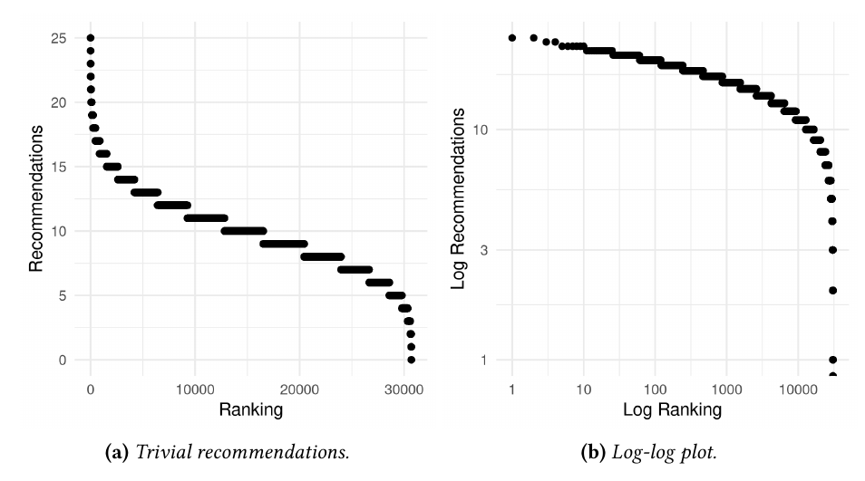
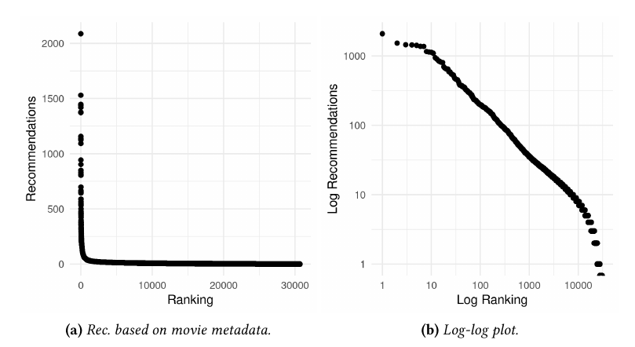
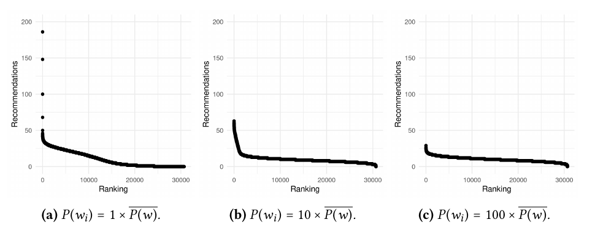
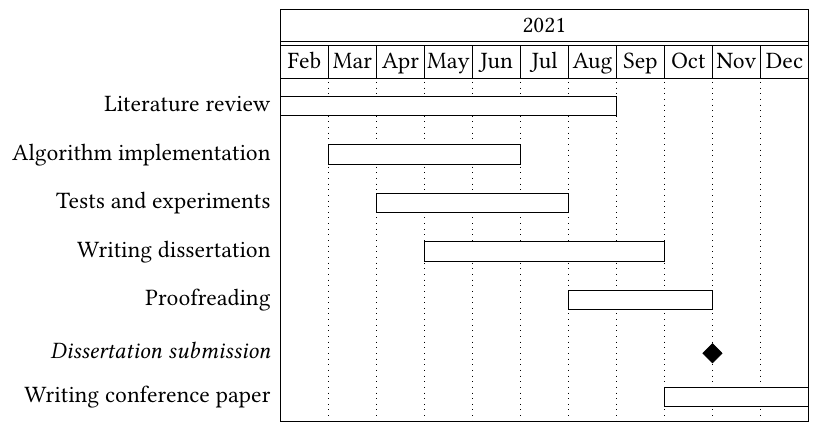

```{r, include=FALSE, warning=FALSE, message=FALSE}
options(htmltools.dir.version = FALSE)
knitr::opts_chunk$set(comment = "#>", echo=TRUE, fig.align='center')
```

# Motivation

- Social networks are ubiquitous: socializing, reading news, expressing
ourselves

- The public wants to know what role their platforms might have in radicalizing
users, specially younger ones

  - Mainly anecdotal evidence (e.g. Facebook depression experiments, YouTube's
  bizarre videos aimed at kids, etc.)

- Journalists and specialists alike argue that social media’s algorithms are
tuned to peddle conspiracy theories, extremist views, and false information

- The debate around the role of recommender systems in social media
radicalization is still too recent and based in anecdotes

- More quality research is vital to inform both the public and opinion makers
about if and how much recommendation algorithms influence social media users

---
# Literature Review

- F. Ricci, L. Rokach, and B. Shapira, "Recommender Systems Handbook"

- Z. Zhao et al., "Recommending what video to watch next: a multitask ranking
system"

- A. Sîrbu, D. Pedreschi, F. Giannotti, and J. Kertész, "Algorithmic bias
amplifies opinion fragmentation and polarization: A bounded confidence model"

- A.-A. Stoica, C. Riederer, and A. Chaintreau, "Algorithmic Glass Ceiling in
Social Networks: The effects of social recommendations on network diversity"

- M. H. Ribeiro, R. Ottoni, R. West, V. A. F. Almeida, and W. Meira, "Auditing
radicalization pathways on YouTube"

- C. Roth, A. Mazières, and T. Menezes, "Tubes and bubbles topological
confinement of YouTube recommendations"

---
# Proposal

- How social networks recommend content to users is relevant to recent waves of
political polarization and radicalization

- Most of the algorithms currently employed by social media companies are trade,
and subject to constant experimentation and tuning

  - E.g., YouTube has over 2 billion monthly logged-in users, but it makes no
  significant effort to clarify changes made to the algorithm
  
  - Most of the developing world still isn't impacted by policy changes
  
- The goal is to understand how their algorithmic design might foster
confinement dynamics in the "phase space" of recommendations

  - Do recommendation algorithms always create "filter bubbles", suggesting ever
  more engaging videos about a certain topic?

---
# MovieLens

- The main dataset used for experimentation was MovieLens

  - F. M. Harper and J. A. Konstan, "The MovieLens Datasets: History and
  Context"

  - A well-known set of movie reviews
  
- 25M ratings applied to 62K movies by 162K users, enriched with information
about the movies' credits, metadata, keywords, and links

  - A sample of 30,689 movies was taken in order to reduce the hardware
  requirements of iterative experimentation

---
# Book-Crossing

- The dataset used to validate hypotheses was Book-Crossing

  - C.-N. Ziegler, "Book-Crossing Dataset"
  
  - A well-known set of book reviews

- 1.1M ratings applied by 278K users to 271K books, and information like
title, author, publisher, etc.

  - A sample of 20,000 books was taken in order to reduce the hardware
  requirements of iterative experimentation

---
# Techniques

- Excluding user information is important because they might transfer their own
biases to the model

  - Content-based recommender: able to identify similar items based on their
  metadata and suggest the closest items
  
  - Create a vector representation of each item and then use a similarity metric
  to recommend the most similar items to the one in question

- "Recommendation profiles": a summary of how many times an arbitrary item is
recommended overall

  - The algorithm is asked to return the top-n most similar items to the input
  according to its internal metric, and this is repeated for every item
  
  - The number of times each item showed up in the top-n most similar items

---
# Techniques (cont.)

- "Trivial model": a simple sampler that returns n movies at random when asked
for a recommendation
  
- "Vanilla model": generated vector representations for the MovieLens dataset,
without any modifications

  - Each position represented one of the words of the corpus, and each element
  indicated how many times that word appeared in the metadata
  
  - The internal metric used, by default, was cosine similarity
  
- "Sparse model": representations were based on fictional metadata that were
comprised of words sampled at random from the full corpus

  - The sparsity of the vector could be changed by changing how many elements
  of the vector should be non-zero

---
# Preliminary Results

```{r, echo=FALSE, fig.align="center", dpi=110}

```

---
# Preliminary Results (cont.)

```{r, echo=FALSE, fig.align="center", dpi=90}

```

---
# Preliminary Results (cont.)

```{r, echo=FALSE, fig.align="center", dpi=80}

```

---
# Discussion

- More experiments are still necessary in order to identify exactly what is the
nature of the bias detected

  - What movies are the most recommended in each case and whether the subset of
  top-recommended movies is roughly consistent
  
- Using Google’s newly released TensorFlow Recommenders it might be possible to
gather data about what happens as users follow suggestions

  - Goal: determining if the model's dynamic increases or decreases the
  exponential profile of recommendations
  
- Showing that that these algorithms are suggesting a subset of items
exponentially more than the rest could be one more piece evidence

  - Are these social networks are creating filter bubbles that radicalize users?

---
# Schedule

```{r, echo=FALSE, fig.align="center", dpi=90}

```
